# Learn Data Structures and Algorithms with Golang
Welcome to the repository for the exercises from the book **[Learn Data Structures and Algorithms with Golang](https://www.amazon.com/Go-Programming-Beginner-Professional-everything/dp/1803243058)** by **[Bhagvan Kommadi](https://in.linkedin.com/in/bhagvan-kommadi-b463a6)**. This repository contains solutions for each chapter of the book.

## Table of Contents

0. [Hello World](#hello-world-)

1. [Section 1: Introduction to Data Structures and Algorithms and the Go Language](#section-1-introduction-to-data-structures-and-algorithms-and-the-go-language)
    1. [Chapter 1: Data Structures and Algorithms](#chapter-1-data-structures-and-algorithms)
        * [List](#list)
        * [Tuples](#tuples)
        * [Heap](#heap)
        * [Adapter](#adapter)
        * [Bridge](#bridge)
        * [Composite](#composite)
        * [Decorator](#decorator)
        * [Facade](#facade)
        * [Flyweight](#flyweight)
        * [Private Class](#private-class)
        * [Proxy](#proxy)
        * [Flow chart](#flow-chart)
        * [Pseudo code](#pseudo-code)
        * [Complexity and performance analysis](#complexity-and-performance-analysis)
        * [Complexity](#complexity)
        * [Linear Complexity](#linear-complexity)
        * [Quadratic Complexity](#quadratic-complexity)
		* [Cubic Complexity](#cubic-complexity)
		* [Logarithmic Complexity](#logarithmic-complexity)
        * [Brute force algorithm](#brute-force-algorithms)

    2. [Chapter 2: Getting Started with Go for Data Structures and Algorithms Technical requirements](#chapter-2-getting-started-with-go-for-data-structures-and-algorithms-technical-requirements)


## Hello World !

This is the traditional "Hello World" program in Go. It is the first program that most people write when they are learning a new programming language. The program prints the string "Hello, World!" to the console.
You can run the program below by copying the code into a file named `hello-world.go` and running `go run hello-world.go` in your terminal.

[Code](./HelloWorld/hello_world.go)

```go
package main

import "fmt"

func main() {
	fmt.Println("Hello, World!")
}
```

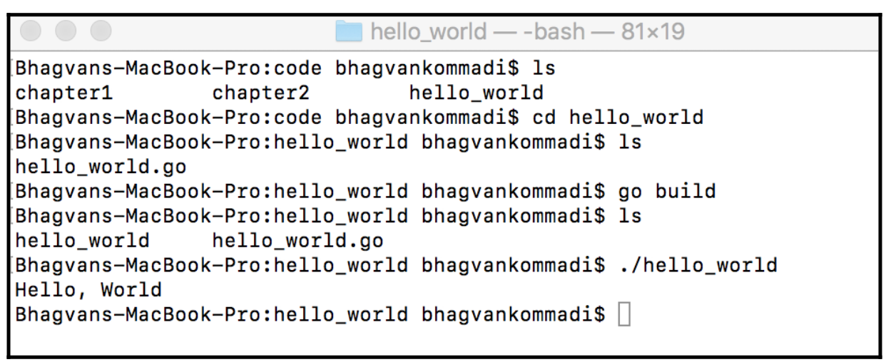

## Section 1: Introduction to Data Structures and Algorithms and the Go Language

We will be introducing the abstract data types, definition, and classification of data
structures. Readers will be well-versed with performance analysis of algorithms and
choosing appropriate data structures for structural design patterns after reading this part.

## Chapter 1: Data Structures and Algorithms

Data Structures and Algorithms, focuses on the definition of abstract data types,
classifying data structures into linear, non-linear, homogeneous, heterogeneous, and
dynamic types. Abstract data types, such as container, list, set, map, graph, stack, and
queue, are presented in this chapter. This chapter also covers the performance analysis of
data structures, as well as the correct choice of data structures and structural design
patterns

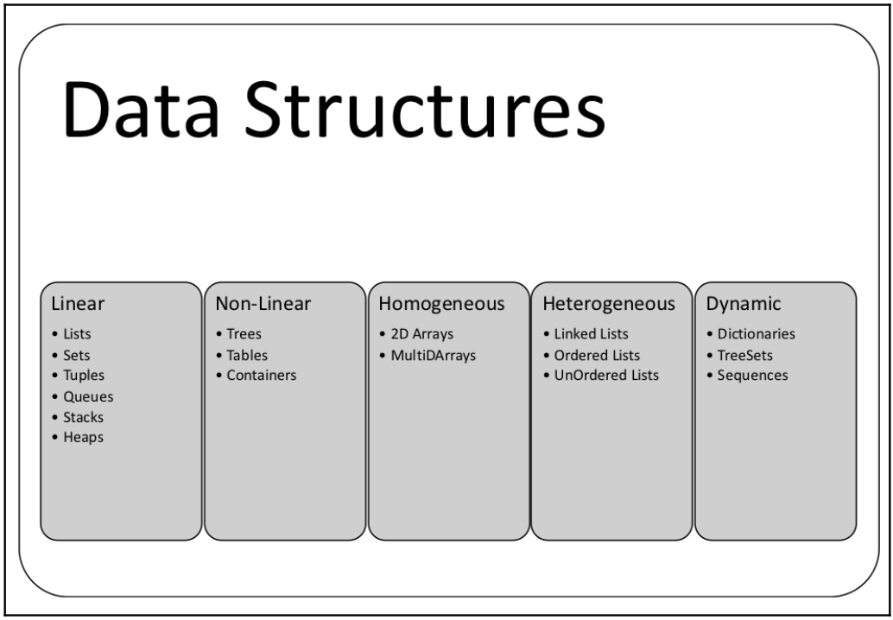

## List

[Code](./Chapter01/List/list.go)

```go
package main

import (
	"container/list"
	"fmt"
)

func main() {
	var intList list.List

	intList.PushBack(11)
	intList.PushBack(23)
	intList.PushBack(34)

	for element := intList.Front(); element != nil; element = element.Next() {
		fmt.Println(element.Value.(int))
	}
}
```


## Tuples

[Code](./Chapter01/Tuples/tuples.go)

```go
package main

import (
	"fmt"
)

func powerSeries(a int) (int, int) {
	return a * a, a * a * a
}

func powerSeriesNamed(a int) (square int, cube int) {
	square = a * a
	cube = a * a * a
	return
}

func powerSeriesError(a int) (int, int, error) {
	var square int = a * a
	var cube int = a * a * a
	return square, cube, nil
}

func main() {
	var square int
	var cube int

	square, cube = powerSeries(3)

	fmt.Println("Square", square, "Cube", cube)
	fmt.Println(powerSeriesNamed(4))
	fmt.Println(powerSeriesError(5))
}
```

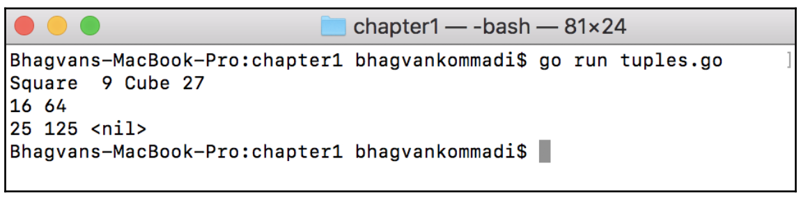

## Heap

[Code](./Chapter01/Heap/heap.go)

```go
package main

import (
	"container/heap"
	"fmt"
)

type IntegerHeap []int

func (iheap IntegerHeap) Len() int { return len(iheap) }

func (iheap IntegerHeap) Less(i, j int) bool { return iheap[i] < iheap[j] }

func (iheap IntegerHeap) Swap(i, j int) { iheap[i], iheap[j] = iheap[j], iheap[i] }

func (iheap *IntegerHeap) Push(heapintf interface{}) {
	*iheap = append(*iheap, heapintf.(int))
}

func (iheap *IntegerHeap) Pop() interface{} {
	var n int
	var x1 int
	var previous IntegerHeap = *iheap
	n = len(previous)
	x1 = previous[n-1]
	*iheap = previous[0 : n-1]
	return x1
}

func main() {
	var intHeap *IntegerHeap = &IntegerHeap{1, 4, 5}
	heap.Init(intHeap)
	heap.Push(intHeap, 2)
	fmt.Printf("minimum: %d\n", (*intHeap)[0])

	for intHeap.Len() > 0 {
		fmt.Printf("%d \n", heap.Pop(intHeap))
	}
}
```

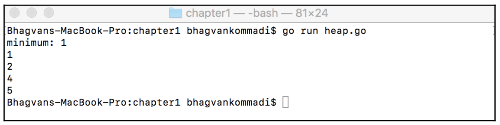

## Adapter


### Read more about the Adapter pattern:

[Refactoring.guru](https://refactoring.guru/design-patterns/adapter) \
[GolangByExample.com](https://golangbyexample.com/adapter-design-pattern-go/)

[Code](./Chapter01/Adapter/adapter.go)

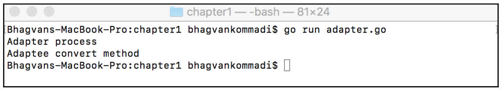

## Bridge


### Read more about the Bridge pattern:
[Refactoring.guru](https://refactoring.guru/design-patterns/bridge) \
[GolangByExample.com](https://golangbyexample.com/bridge-design-pattern-in-go/)

[Code](./Chapter01/Bridge/bridge.go)

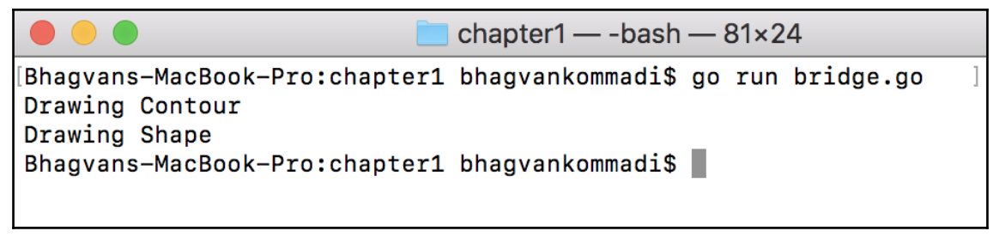

## Composite


### Read more about the Composite pattern:
[Refactoring.guru](https://refactoring.guru/design-patterns/composite) \
[GolangByExample.com](https://golangbyexample.com/composite-design-pattern-golang)

[Code](./Chapter01/Composite/composite.go)

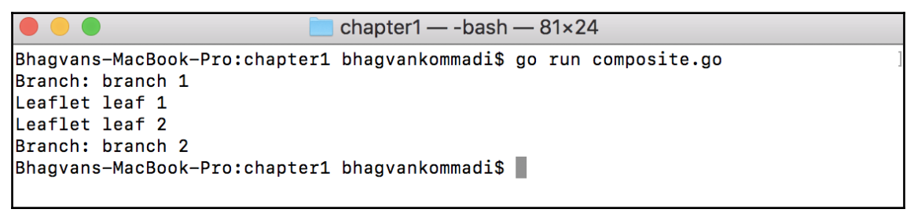

## Decorator


### Read more about the Decorator pattern:
[Refactoring.guru](https://refactoring.guru/design-patterns/decorator) \
[GolangByExample.com](https://golangbyexample.com/decorator-pattern-golang/)

[Code](./Chapter01/Decorator/decorator.go)

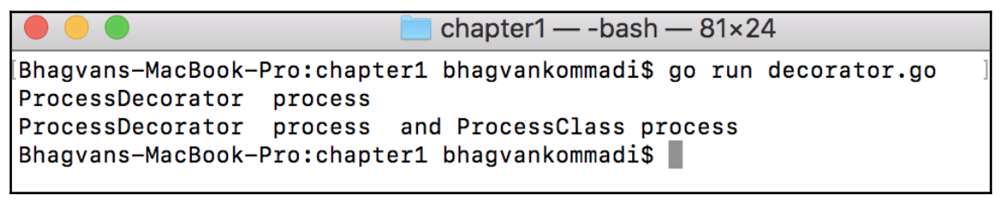

## Facade


### Read more about the Facade pattern:
[Refactoring.guru](https://refactoring.guru/design-patterns/facade) \
[GolangByExample.com](https://golangbyexample.com/facade-design-pattern-in-golang/)

[Code](./Chapter01/Facade/facade.go)

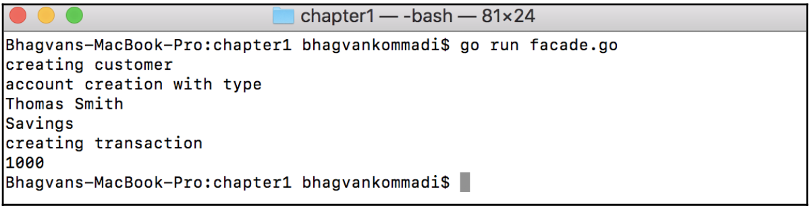

## Flyweight


### Read more about the Flyweight pattern:
[Refactoring.guru](https://refactoring.guru/design-patterns/flyweight) \
[GolangByExample.com](https://golangbyexample.com/flyweight-design-pattern-golang/)

[Code](./Chapter01/Flyweight/flyweight.go)

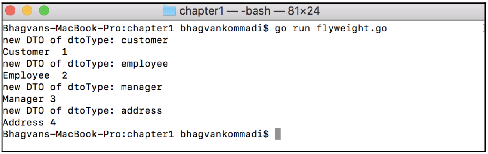

## Private Class

[Code](./Chapter01/PrivateClass/private_class.go)

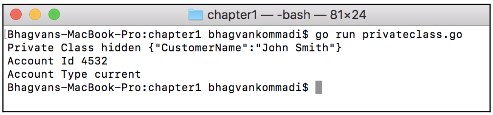

## Proxy


### Read more about the Proxy pattern:
[Refaactoring.guru](https://refactoring.guru/design-patterns/proxy) \
[GolangByExample.com](https://golangbyexample.com/proxy-design-pattern-in-golang/)

[Code](./Chapter01/Proxy/proxy.go)

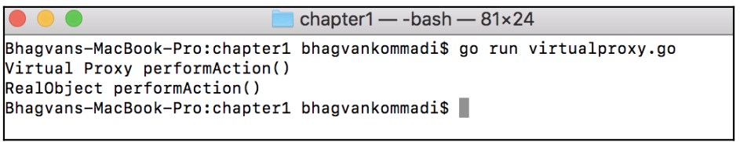

## Flow chart
Example of Flow chart

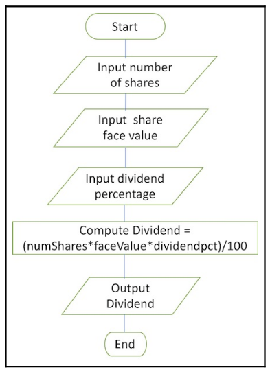

## Pseudo code
Example of pseudo code
```pseudo-code
maximum(arr) {
    n <- len(arr)
    max <- arr[0]
    for k <-0, n do {
        if arr[k] > max {
            max <-arr[k]
        }
    }
    return max
}
```

## Complexity and performance analysis
The complexity is how the algorithm scales when the number
of input parameters increases.

Performance is a measure of time, space, memory, and other
parameters

## Complexity

[Code](./Chapter01/Complexity/complexity.go)

```go
package main

import "fmt"

func main() {
	var (
		m [10]int
		k int
	)

	for k = 0; k < 10; k++ {
		m[k] = k + 200
		fmt.Printf("Element [%d] = %d\n", k, m[k])
	}
}
```

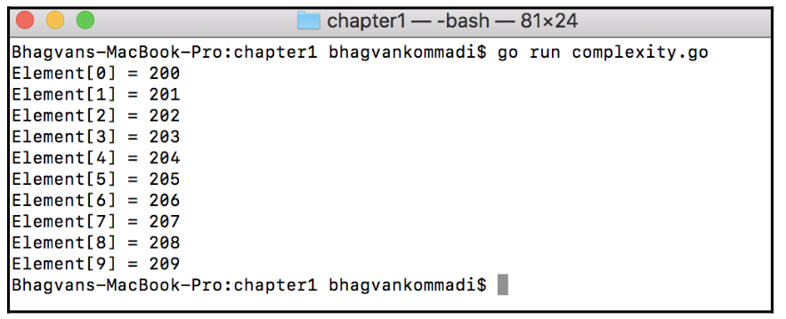

## BigO notation

*T(n)=O(n)*

Using Big O notation, the constant time *O(1)*, linear time *O(n)*, logarithmic time *O(logn)*, cubic time *O(n^3)* and quadratic time *O(n^2)* complexity are different complexity types for an algorithm.

## Linear complexity

[Code](./Chapter01/LinearComplexity/linear_complexity.go)

```go
package main

import "fmt"

func main() {
	var (
		m [10]int
		k int
	)

	for k = 0; k < 10; k++ {
		m[k] = k * 200
		fmt.Printf("Element[%d] = %d\n", k, m[k])
	}
}
```

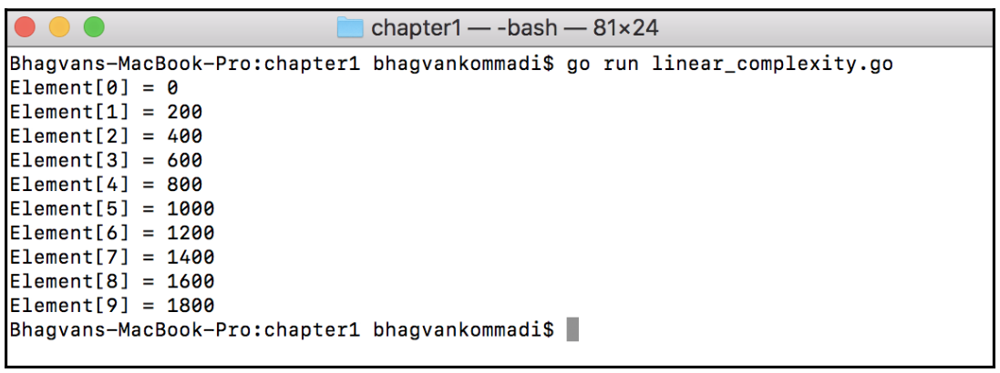

## Quadratic complexit

[Code](./Chapter01/QuadraticComplexity/quadratic_complexity.go)

```go
package main

import "fmt"

func main() {
	var (
		k, l int
	)

	for k = 1; k <= 10; k++ {
		fmt.Println("Multiplication Table", k)
		for l = 1; l <= 10; l++ {
			var x int = l * k
			fmt.Println(x)
		}
	}
}
```

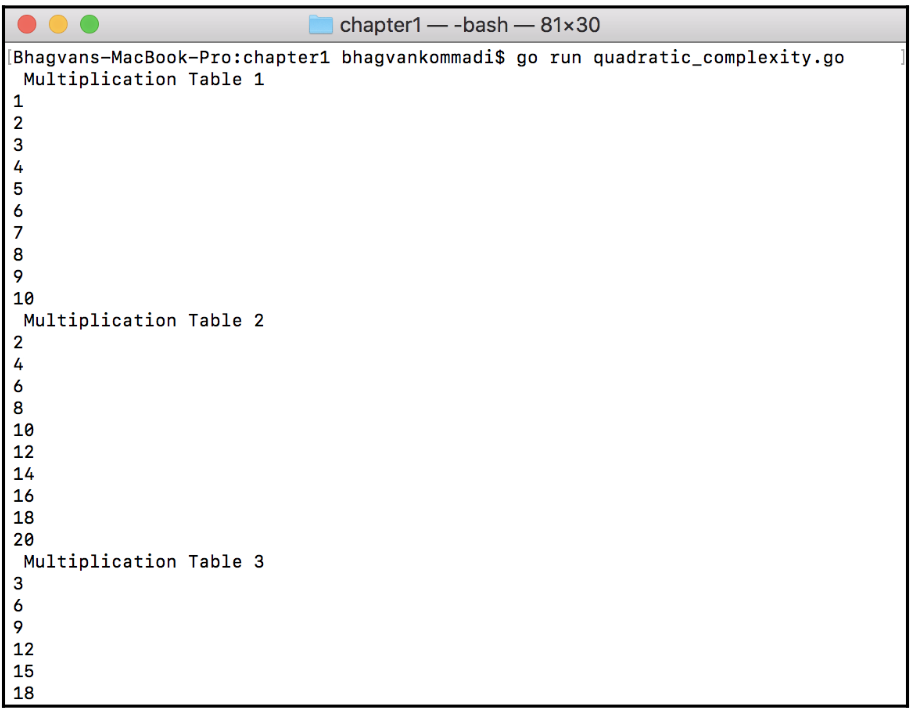

## Cubic Complexity

[Code](./Chapter01/CubicComplexity/cubic_complexity.go)

```go
package main

import "fmt"

func main() {
	var k, l, m int

	var arr [10][10][10]int

	for k = 0; k < 10; k++ {
		for l = 0; l < 10; l++ {
			for m = 0; m < 10; m++ {
				arr[k][l][m] = 1
				fmt.Println("Element value ", k, l, m, arr[k][l][m])
			}
		}
	}
}
```

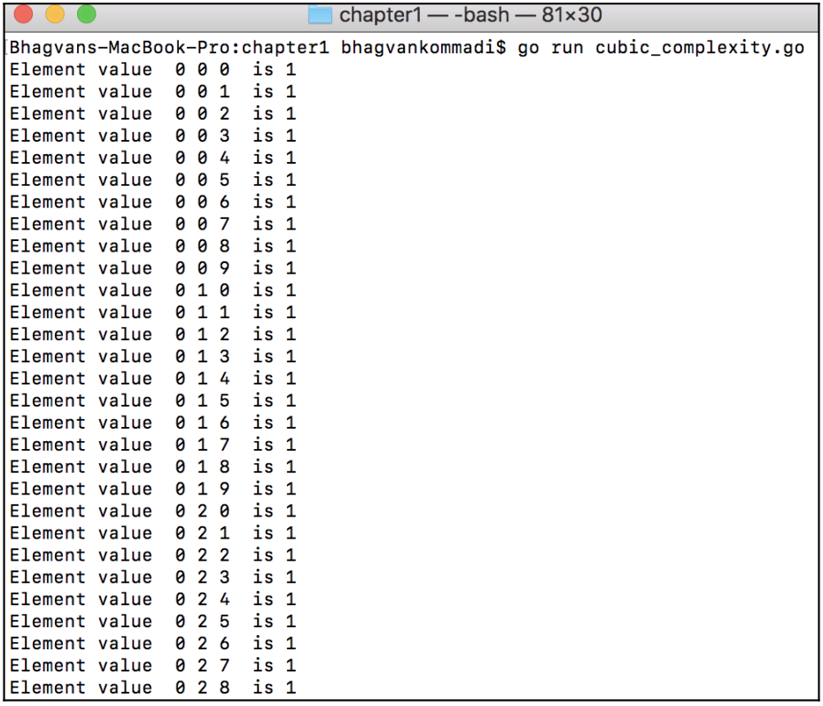

## Logarithmic complexity

[Code](./Chapter01/LogarithmicComplexity/logarithmic_complexity.go)

```go
package main

import "fmt"

type Tree struct {
	LeftNode  *Tree
	Value     int
	RightNode *Tree
}

func (tree *Tree) insert(m int) {
	if tree != nil {
		if tree.LeftNode == nil {
			tree.LeftNode = &Tree{nil, m, nil}
		} else {
			if tree.RightNode == nil {
				tree.RightNode = &Tree{nil, m, nil}
			} else {
				if tree.LeftNode != nil {
					tree.LeftNode.insert(m)
				} else {
					tree.RightNode.insert(m)
				}
			}
		}
	} else {
		tree = &Tree{nil, m, nil}
	}
}

func print(tree *Tree) {
	if tree != nil {
		fmt.Println("Value", tree.Value)
		fmt.Printf("Tree Node Left")
		print(tree.LeftNode)
		fmt.Printf("Tree Node Right")
		print(tree.RightNode)
	} else {
		fmt.Printf("Nil\n")
	}
}

func main() {
	var tree *Tree = &Tree{nil, 1, nil}
	print(tree)
	tree.insert(3)
	print(tree)
	tree.insert(5)
	print(tree)
	tree.LeftNode.insert(7)
	print(tree)
}
```

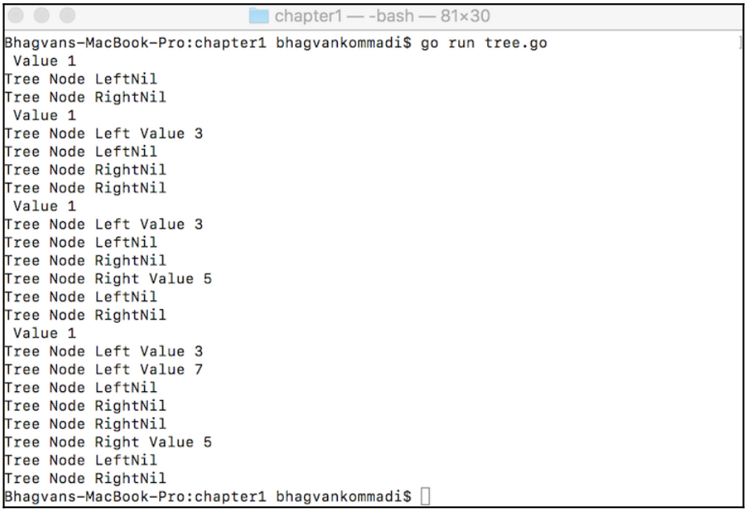

## Brute force algorithms

[Code](./Chapter01/BruteForceAlgorithms/brute_force_algorithms.go)

```go
package main

import "fmt"

func findElement(arr [10]int, k int) bool {
	var i int
	for i = 0; i < 10; i++ {
		if arr[i] == k {
			return true
		}
	}

	return false
}

func main() {
	var arr = [10]int{1, 4, 7, 8, 3, 9, 2, 4, 1, 9}
	var check bool = findElement(arr, 10)
	fmt.Println(check)

	var check2 bool = findElement(arr, 9)
	fmt.Println(check2)
}
```

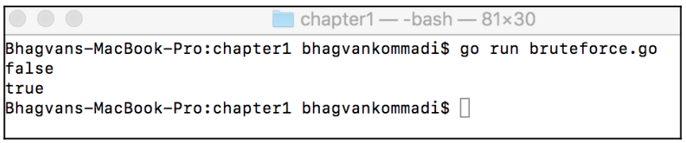

## Divede and Conquer Algorithms

[Code](./Chapter01/DivedeAndConquerAlgorithms/divede_and_conquer_algorithms.go)

```go
package main

import "fmt"

func fibonacci(k int) int {
	if k <= 1 {
		return 1
	}

	return fibonacci(k-1) + fibonacci(k-2)
}

func main() {
	var i int = 5
	for i = 0; i < 8; i++ {
		var fib = fibonacci(i)
		fmt.Println(fib)
	}
}
```

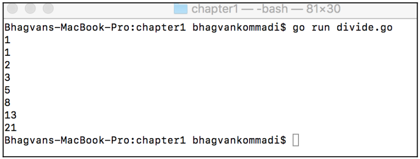

## Backtracking algorithms

[Code](./Chapter01/BacktrackingAlgorithms/backtracking_algorithms.go)

```go
package main

import "fmt"

func findElementWithSum(arr [10]int, combinations [19]int, size int, k int, addValue int, l int, m int) int {
	var num int = 0

	if addValue > k {
		return -1
	}

	if addValue == k {
		num++
		var p int = 0
		for p = 0; p < m; p++ {
			fmt.Printf("%d, ", arr[combinations[p]])
		}
		fmt.Println(" ")
	}

	var i int
	for i = l; i < size; i++ {
		combinations[m] = l
		findElementWithSum(arr, combinations, size, k, addValue+arr[i], l, m+1)
		l++
	}
	return num
}

func main() {
	var arr = [10]int{1, 4, 7, 8, 3, 9, 2, 4, 1, 8}
	var addedSum = 18
	var combinations [19]int
	findElementWithSum(arr, combinations, 10, addedSum, 0, 0, 0)
}
```

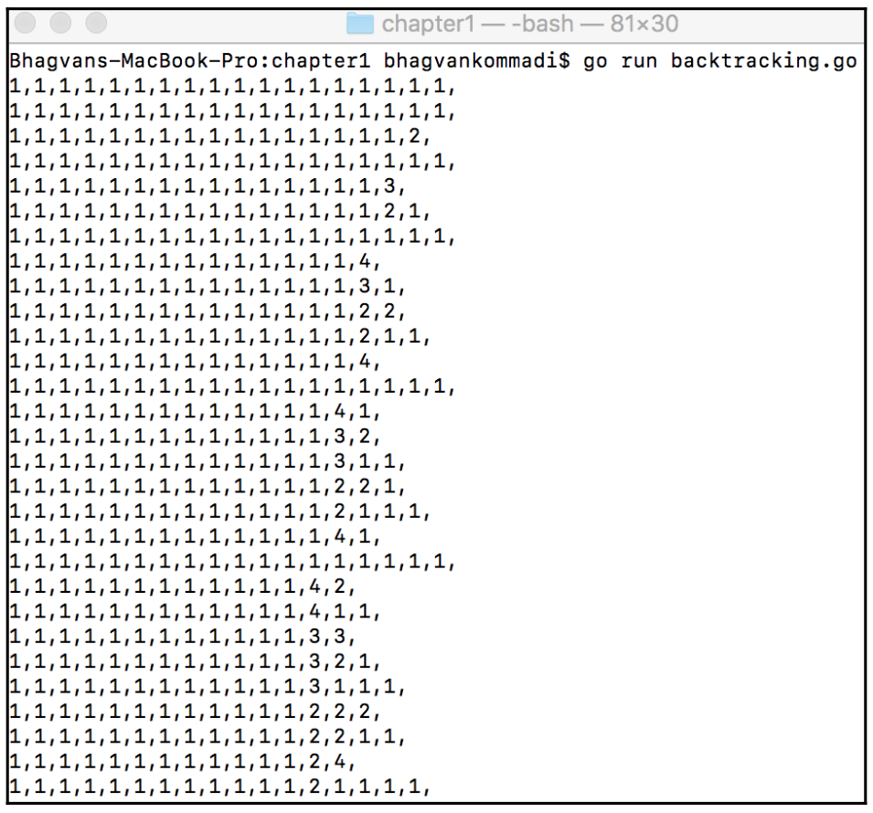

## Chapter 2: Getting Started with Go for Data Structures and Algorithms Technical requirements

Getting Started with Go for Data Structures and Algorithms, covers Go-specific data
structures, such as arrays, slices, two-dimensional slices, maps, structs, and channels.
Variadic functions, deferred function calls, and panic and recover operations are
introduced. Slicing operations, such as enlarging using append and copy, assigning parts,
appending a slice, and appending part of a slice, are also presented in this chapter.

## Contributing

Contributions are welcome! If you have a solution to an exercise that is different from the one provided, feel free to open a pull request.

1. Fork the repository.
2. Create a new branch (`git checkout -b feature/exercise-solution`).
3. Commit your changes (`git commit -m 'Add solution for Exercise X.Y'`).
4. Push to the branch (`git push origin feature/exercise-solution`).
5. Open a pull request.

## License

This project is licensed under the MIT License - see the [LICENSE](LICENSE) file for details.
