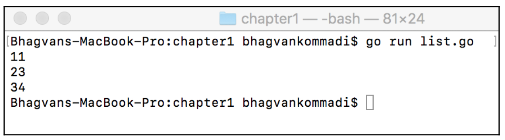

# Learn Data Structures and Algorithms with Golang
Welcome to the repository for the exercises from the book **[Learn Data Structures and Algorithms with Golang](https://www.amazon.com/Go-Programming-Beginner-Professional-everything/dp/1803243058)** by **[Bhagvan Kommadi](https://in.linkedin.com/in/bhagvan-kommadi-b463a6)**. This repository contains solutions for each chapter of the book.

## Table of Contents

0. [Hello World](#hello-world-)

1. [Section 1: Introduction to Data Structures and Algorithms and the Go Language](#section-1-introduction-to-data-structures-and-algorithms-and-the-go-language)
    1. [Chapter 1: Data Structures and Algorithms](#chapter-1-data-structures-and-algorithms)
        * [List](#list)
        * [Tuples](#tuples)
        * [Heap](#heap)
        * [Adapter](#adapter)
        * [Bridge](#bridge)
        * [Composite](#composite)
        * [Decorator](#decorator)
        * [Facade](#facade)
        * [Flyweight](#flyweight)
        * [Private Class](#private-class)
        * [Proxy](#proxy)
        * [Flow chart](#flow-chart)
        * [Pseudo code](#pseudo-code)
        * [Complexity and performance analysis](#complexity-and-performance-analysis)
        * [Complexity](#complexity)
        * [Linear Complexity](#linear-complexity)
        * [Quadratic Complexity](#quadratic-complexity)
		* [Cubic Complexity](#cubic-complexity)
		* [Logarithmic Complexity](#logarithmic-complexity)
        * [Brute force algorithm](#brute-force-algorithms)
		* [Divede and Conquer Algorithms](#divede-and-conquer-algorithms)
		* [Backtracking algorithms](#backtracking-algorithms)

    2. [Chapter 2: Getting Started with Go for Data Structures and Algorithms Technical requirements](#chapter-2-getting-started-with-go-for-data-structures-and-algorithms-technical-requirements)
        * [Arrays](#arrays)
		* [The Len function](#the-len-function)
		* [Slice function](#slice-function)
		* [Two dimensional slices](#two-dimensional-slices)
		* [Maps](#maps)

## Hello World !

This is the traditional "Hello World" program in Go. It is the first program that most people write when they are learning a new programming language. The program prints the string "Hello, World!" to the console.
You can run the program below by copying the code into a file named `hello-world.go` and running `go run hello-world.go` in your terminal.

[Code](./HelloWorld/hello_world.go)

```go
package main

import "fmt"

func main() {
	fmt.Println("Hello, World!")
}
```


## Section 1: Introduction to Data Structures and Algorithms and the Go Language

We will be introducing the abstract data types, definition, and classification of data
structures. Readers will be well-versed with performance analysis of algorithms and
choosing appropriate data structures for structural design patterns after reading this part.

## Chapter 1: Data Structures and Algorithms

Data Structures and Algorithms, focuses on the definition of abstract data types,
classifying data structures into linear, non-linear, homogeneous, heterogeneous, and
dynamic types. Abstract data types, such as container, list, set, map, graph, stack, and
queue, are presented in this chapter. This chapter also covers the performance analysis of
data structures, as well as the correct choice of data structures and structural design
patterns


## List

[Code](./Chapter01/01-List/list.go)

```go
package main

import (
	"container/list"
	"fmt"
)

func main() {
	var intList list.List

	intList.PushBack(11)
	intList.PushBack(23)
	intList.PushBack(34)

	for element := intList.Front(); element != nil; element = element.Next() {
		fmt.Println(element.Value.(int))
	}
}
```



## Tuples

[Code](./Chapter01/02-Tuples/tuples.go)

```go
package main

import (
	"fmt"
)

func powerSeries(a int) (int, int) {
	return a * a, a * a * a
}

func powerSeriesNamed(a int) (square int, cube int) {
	square = a * a
	cube = a * a * a
	return
}

func powerSeriesError(a int) (int, int, error) {
	var square int = a * a
	var cube int = a * a * a
	return square, cube, nil
}

func main() {
	var square int
	var cube int

	square, cube = powerSeries(3)

	fmt.Println("Square", square, "Cube", cube)
	fmt.Println(powerSeriesNamed(4))
	fmt.Println(powerSeriesError(5))
}
```


## Heap

[Code](./Chapter01/03-Heap/heap.go)

```go
package main

import (
	"container/heap"
	"fmt"
)

type IntegerHeap []int

func (iheap IntegerHeap) Len() int { return len(iheap) }

func (iheap IntegerHeap) Less(i, j int) bool { return iheap[i] < iheap[j] }

func (iheap IntegerHeap) Swap(i, j int) { iheap[i], iheap[j] = iheap[j], iheap[i] }

func (iheap *IntegerHeap) Push(heapintf interface{}) {
	*iheap = append(*iheap, heapintf.(int))
}

func (iheap *IntegerHeap) Pop() interface{} {
	var n int
	var x1 int
	var previous IntegerHeap = *iheap
	n = len(previous)
	x1 = previous[n-1]
	*iheap = previous[0 : n-1]
	return x1
}

func main() {
	var intHeap *IntegerHeap = &IntegerHeap{1, 4, 5}
	heap.Init(intHeap)
	heap.Push(intHeap, 2)
	fmt.Printf("minimum: %d\n", (*intHeap)[0])

	for intHeap.Len() > 0 {
		fmt.Printf("%d \n", heap.Pop(intHeap))
	}
}
```


## Adapter


### Read more about the Adapter pattern:

[Refactoring.guru](https://refactoring.guru/design-patterns/adapter) \
[GolangByExample.com](https://golangbyexample.com/adapter-design-pattern-go/)

[Code](./Chapter01/04-Adapter/adapter.go)

```go
package main

import "fmt"

type IProcess interface {
	process()
}

type Adapter struct {
	adaptee Adaptee
}

func (adapter Adapter) process() {
	fmt.Println("Adapter process")
	adapter.adaptee.convert()
}

type Adaptee struct {
	adapterType int
}

func (adaptee Adaptee) convert() {
	fmt.Println("Adaptee convert method")
}

func main() {
	var processor IProcess = Adapter{}
	processor.process()
}
```


## Bridge


### Read more about the Bridge pattern:
[Refactoring.guru](https://refactoring.guru/design-patterns/bridge) \
[GolangByExample.com](https://golangbyexample.com/bridge-design-pattern-in-go/)

[Code](./Chapter01/05-Bridge/bridge.go)

```go
package main

import "fmt"

type IDrawShape interface {
	drawShape(x [5]float32, y [5]float32)
}

type DrawShape struct{}

func (drawShape DrawShape) drawShape(x [5]float32, y [5]float32) {
	fmt.Println("Drawing Shape")
}

type IContour interface {
	drawContour(x [5]float32, y [5]float32)
	resizeByFactor(factor int)
}

type Contour struct {
	x      [5]float32
	y      [5]float32
	shape  DrawShape
	factor int
}

func (contour Contour) drawContour(x [5]float32, y [5]float32) {
	fmt.Println("Drawing Contour")
	contour.shape.drawShape(contour.x, contour.y)
}
func (contour Contour) resizeByFactor(factor int) {
	contour.factor = factor
}

func main() {
	var x = [5]float32{1, 2, 3, 4, 5}
	var y = [5]float32{1, 2, 3, 4, 5}
	var contour IContour = Contour{x: x, y: y}
	contour.drawContour(x, y)
	contour.resizeByFactor(2)
}
```


## Composite


### Read more about the Composite pattern:
[Refactoring.guru](https://refactoring.guru/design-patterns/composite) \
[GolangByExample.com](https://golangbyexample.com/composite-design-pattern-golang)

[Code](./Chapter01/06-Composite/composite.go)

```go
package main

import "fmt"

type IComposite interface {
	perform()
}

type Branch struct {
	leafs    []Leaflet
	name     string
	branches []Branch
}

func (branch *Branch) perform() {
	fmt.Println("Branch: " + branch.name)
	for _, leaf := range branch.leafs {
		leaf.perform()
	}

	for _, branch := range branch.branches {
		branch.perform()
	}
}
func (branch *Branch) addLeaf(leaf Leaflet) {
	branch.leafs = append(branch.leafs, leaf)
}
func (branch *Branch) addBranch(newBranch Branch) {
	branch.branches = append(branch.branches, newBranch)
}

func (branch *Branch) getLeaflets() []Leaflet {
	return branch.leafs
}

type Leaflet struct {
	name string
}

func (leaf *Leaflet) perform() {
	fmt.Println("Leaflet: " + leaf.name)
}

func main() {
	var branch = &Branch{name: "branch 1"}
	var leaf1 = Leaflet{name: "leaf 1"}
	var leaf2 = Leaflet{name: "leaf 2"}
	var branch2 = Branch{name: "branch 2"}

	branch.addLeaf(leaf1)
	branch.addLeaf(leaf2)
	branch.addBranch(branch2)

	branch.perform()

}
```


## Decorator


### Read more about the Decorator pattern:
[Refactoring.guru](https://refactoring.guru/design-patterns/decorator) \
[GolangByExample.com](https://golangbyexample.com/decorator-pattern-golang/)

[Code](./Chapter01/07-Decorator/decorator.go)

```go
package main

import "fmt"

type IProcess interface {
	process()
}

type Process struct{}

func (process Process) process() {
	fmt.Println("Process process")
}

type ProcessDecorator struct {
	processInstance *Process
}

func (decorator *ProcessDecorator) process() {
	if decorator.processInstance == nil {
		fmt.Println("ProcessDecorator process")
	} else {
		fmt.Printf("ProcessDecorator process and ")
		decorator.processInstance.process()
	}
}

func main() {
	var process = &Process{}
	var decorator = &ProcessDecorator{}

	decorator.process()
	decorator.processInstance = process
	decorator.process()

}
```


## Facade


### Read more about the Facade pattern:
[Refactoring.guru](https://refactoring.guru/design-patterns/facade) \
[GolangByExample.com](https://golangbyexample.com/facade-design-pattern-in-golang/)

[Code](./Chapter01/08-Facade/facade.go)

```go
package main

import "fmt"

type Account struct {
	id          string
	accountType string
}

func (account *Account) create(accountType string) *Account {
	fmt.Println("Account creation with type")
	account.accountType = accountType
	return account
}

func (account *Account) getById(id string) *Account {
	fmt.Println("Getting account by id")
	return account
}

func (account *Account) deleteById(id string) {
	fmt.Println("Delete account by id")
}

type Customer struct {
	id   string
	name string
}

func (customer *Customer) create(name string) *Customer {
	fmt.Println("Customer creation")
	customer.name = name
	return customer
}

type Transaction struct {
	id            string
	amount        float32
	srcAccountId  string
	destAccountId string
}

func (transaction *Transaction) create(srcAccountId, destAccountId string, amount float32) *Transaction {
	fmt.Println("Transaction creation")
	transaction.srcAccountId = srcAccountId
	transaction.destAccountId = destAccountId
	transaction.amount = amount
	return transaction
}

type BranchManagerFacade struct {
	account     *Account
	customer    *Customer
	transaction *Transaction
}

func NewBranchManagerFacade() *BranchManagerFacade {
	return &BranchManagerFacade{&Account{}, &Customer{}, &Transaction{}}
}

func (facade *BranchManagerFacade) createCustomerAccount(customerName, accountType string) (*Customer, *Account) {
	var customer = facade.customer.create(customerName)
	var account = facade.account.create(accountType)
	return customer, account
}

func (facade *BranchManagerFacade) createTransaction(srcAccountId, destAccountId string, amount float32) *Transaction {
	var transaction = facade.transaction.create(srcAccountId, destAccountId, amount)
	return transaction
}

func main() {
	var facade = NewBranchManagerFacade()
	var customer *Customer
	var account *Account

	customer, account = facade.createCustomerAccount("John Doe", "savings")
	fmt.Println(customer.name)
	fmt.Println(account.accountType)
	var transaction = facade.createTransaction("1", "2", 100)
	fmt.Println(transaction.amount)
}
```


## Flyweight


### Read more about the Flyweight pattern:
[Refactoring.guru](https://refactoring.guru/design-patterns/flyweight) \
[GolangByExample.com](https://golangbyexample.com/flyweight-design-pattern-golang/)

[Code](./Chapter01/09-Flyweight/flyweight.go)

```go
package main

import "fmt"

type DataTransferObject interface {
	getId() string
}

type Customer struct {
	id   string
	name string
	ssn  string
}

func (customer Customer) getId() string {
	return customer.id
}

type Employee struct {
	id   string
	name string
}

func (employee Employee) getId() string {
	return employee.id
}

type Manager struct {
	id   string
	name string
	dept string
}

func (manager Manager) getId() string {
	return manager.id
}

type Address struct {
	id          string
	streetLine1 string
	streetLine2 string
	state       string
	city        string
}

func (address Address) getId() string {
	return address.id
}

type DataTransferObjectFactory struct {
	pool map[string]DataTransferObject
}

func (factory DataTransferObjectFactory) getDataTransferObject(dtoType string) DataTransferObject {
	var dto = factory.pool[dtoType]

	if dto == nil {
		fmt.Println("new DTO of dtoType: " + dtoType)

		switch dtoType {
		case "customer":
			factory.pool[dtoType] = Customer{id: "1"}
		case "employee":
			factory.pool[dtoType] = Employee{id: "2"}
		case "manager":
			factory.pool[dtoType] = Manager{id: "3"}
		case "address":
			factory.pool[dtoType] = Address{id: "4"}
		}
		dto = factory.pool[dtoType]
	}

	return dto
}

func main() {
	var factory = DataTransferObjectFactory{pool: make(map[string]DataTransferObject)}
	var customer DataTransferObject = factory.getDataTransferObject("customer")
	fmt.Println("Customer ", customer.getId())

	var employee DataTransferObject = factory.getDataTransferObject("employee")
	fmt.Println("Employee ", employee.getId())

	var manager DataTransferObject = factory.getDataTransferObject("manager")
	fmt.Println("Manager ", manager.getId())

	var address DataTransferObject = factory.getDataTransferObject("address")
	fmt.Println("Address ", address.getId())
}
```


## Private Class

[Code](./Chapter01/10-PrivateClass/private_class.go)

```go
package main

import (
	"encoding/json"
	"fmt"
)

type AccountDetails struct {
	id          string
	accountType string
}

type Account struct {
	details      *AccountDetails
	CustomerName string
}

func (account *Account) setDetails(id, accountType string) {
	account.details = &AccountDetails{id, accountType}
}

func (account *Account) getId() string {
	return account.details.id
}

func (account *Account) getAccountType() string {
	return account.details.accountType
}

func main() {
	var account *Account = &Account{CustomerName: "John Smith"}
	account.setDetails("4532", "current")
	jsonAccount, _ := json.Marshal(account)
	fmt.Println("Private Class hidden:", string(jsonAccount))
	fmt.Println("Account ID:", account.getId())
	fmt.Println("Account Type:", account.getAccountType())
}
```


## Proxy


### Read more about the Proxy pattern:
[Refaactoring.guru](https://refactoring.guru/design-patterns/proxy) \
[GolangByExample.com](https://golangbyexample.com/proxy-design-pattern-in-golang/)

[Code](./Chapter01/11-Proxy/proxy.go)

```go
package main

import "fmt"

type RealObject struct {
}

type IRealObject interface {
	performActin()
}

func (realObject *RealObject) performAction() {
	fmt.Println("RealObject performAction()")
}

type VirtualProxy struct {
	realObject *RealObject
}

func (virtualProxy *VirtualProxy) performAction() {
	if virtualProxy.realObject == nil {
		virtualProxy.realObject = &RealObject{}
	}
	fmt.Println("VirtualProxy performAction()")
	virtualProxy.realObject.performAction()
}

func main() {
	var object VirtualProxy = VirtualProxy{}
	object.performAction()
}
```


## Flow chart
Example of Flow chart


## Pseudo code
Example of pseudo code
```pseudo-code
maximum(arr) {
    n <- len(arr)
    max <- arr[0]
    for k <-0, n do {
        if arr[k] > max {
            max <-arr[k]
        }
    }
    return max
}
```

## Complexity and performance analysis
The complexity is how the algorithm scales when the number
of input parameters increases.

Performance is a measure of time, space, memory, and other
parameters

## Complexity

[Code](./Chapter01/12-Complexity/complexity.go)

```go
package main

import "fmt"

func main() {
	var (
		m [10]int
		k int
	)

	for k = 0; k < 10; k++ {
		m[k] = k + 200
		fmt.Printf("Element [%d] = %d\n", k, m[k])
	}
}
```


## BigO notation

*T(n)=O(n)*

Using Big O notation, the constant time *O(1)*, linear time *O(n)*, logarithmic time *O(logn)*, cubic time *O(n^3)* and quadratic time *O(n^2)* complexity are different complexity types for an algorithm.

## Linear complexity

[Code](./Chapter01/13-LinearComplexity/linear_complexity.go)

```go
package main

import "fmt"

func main() {
	var (
		m [10]int
		k int
	)

	for k = 0; k < 10; k++ {
		m[k] = k * 200
		fmt.Printf("Element[%d] = %d\n", k, m[k])
	}
}
```


## Quadratic complexit

[Code](./Chapter01/14-QuadraticComplexity/quadratic_complexity.go)

```go
package main

import "fmt"

func main() {
	var (
		k, l int
	)

	for k = 1; k <= 10; k++ {
		fmt.Println("Multiplication Table", k)
		for l = 1; l <= 10; l++ {
			var x int = l * k
			fmt.Println(x)
		}
	}
}
```


## Cubic Complexity

[Code](./Chapter01/15-CubicComplexity/cubic_complexity.go)

```go
package main

import "fmt"

func main() {
	var k, l, m int

	var arr [10][10][10]int

	for k = 0; k < 10; k++ {
		for l = 0; l < 10; l++ {
			for m = 0; m < 10; m++ {
				arr[k][l][m] = 1
				fmt.Println("Element value ", k, l, m, arr[k][l][m])
			}
		}
	}
}
```


## Logarithmic complexity

[Code](./Chapter01/16-LogarithmicComplexity/logarithmic_complexity.go)

```go
package main

import "fmt"

type Tree struct {
	LeftNode  *Tree
	Value     int
	RightNode *Tree
}

func (tree *Tree) insert(m int) {
	if tree != nil {
		if tree.LeftNode == nil {
			tree.LeftNode = &Tree{nil, m, nil}
		} else {
			if tree.RightNode == nil {
				tree.RightNode = &Tree{nil, m, nil}
			} else {
				if tree.LeftNode != nil {
					tree.LeftNode.insert(m)
				} else {
					tree.RightNode.insert(m)
				}
			}
		}
	} else {
		tree = &Tree{nil, m, nil}
	}
}

func print(tree *Tree) {
	if tree != nil {
		fmt.Println("Value", tree.Value)
		fmt.Printf("Tree Node Left")
		print(tree.LeftNode)
		fmt.Printf("Tree Node Right")
		print(tree.RightNode)
	} else {
		fmt.Printf("Nil\n")
	}
}

func main() {
	var tree *Tree = &Tree{nil, 1, nil}
	print(tree)
	tree.insert(3)
	print(tree)
	tree.insert(5)
	print(tree)
	tree.LeftNode.insert(7)
	print(tree)
}
```


## Brute force algorithms

[Code](./Chapter01/17-BruteForceAlgorithms/brute_force_algorithms.go)

```go
package main

import "fmt"

func findElement(arr [10]int, k int) bool {
	var i int
	for i = 0; i < 10; i++ {
		if arr[i] == k {
			return true
		}
	}

	return false
}

func main() {
	var arr = [10]int{1, 4, 7, 8, 3, 9, 2, 4, 1, 9}
	var check bool = findElement(arr, 10)
	fmt.Println(check)

	var check2 bool = findElement(arr, 9)
	fmt.Println(check2)
}
```


## Divede and Conquer Algorithms

[Code](./Chapter01/18-DivedeAndConquerAlgorithms/divede_and_conquer_algorithms.go)

```go
package main

import "fmt"

func fibonacci(k int) int {
	if k <= 1 {
		return 1
	}

	return fibonacci(k-1) + fibonacci(k-2)
}

func main() {
	var i int = 5
	for i = 0; i < 8; i++ {
		var fib = fibonacci(i)
		fmt.Println(fib)
	}
}
```


## Backtracking algorithms

[Code](./Chapter01/19-BacktrackingAlgorithms/backtracking_algorithms.go)

```go
package main

import "fmt"

func findElementWithSum(arr [10]int, combinations [19]int, size int, k int, addValue int, l int, m int) int {
	var num int = 0

	if addValue > k {
		return -1
	}

	if addValue == k {
		num++
		var p int = 0
		for p = 0; p < m; p++ {
			fmt.Printf("%d, ", arr[combinations[p]])
		}
		fmt.Println(" ")
	}

	var i int
	for i = l; i < size; i++ {
		combinations[m] = l
		findElementWithSum(arr, combinations, size, k, addValue+arr[i], l, m+1)
		l++
	}
	return num
}

func main() {
	var arr = [10]int{1, 4, 7, 8, 3, 9, 2, 4, 1, 8}
	var addedSum = 18
	var combinations [19]int
	findElementWithSum(arr, combinations, 10, addedSum, 0, 0, 0)
}
```


## Chapter 2: Getting Started with Go for Data Structures and Algorithms Technical requirements

Getting Started with Go for Data Structures and Algorithms, covers Go-specific data
structures, such as arrays, slices, two-dimensional slices, maps, structs, and channels.
Variadic functions, deferred function calls, and panic and recover operations are
introduced. Slicing operations, such as enlarging using append and copy, assigning parts,
appending a slice, and appending part of a slice, are also presented in this chapter.

## Arrays

[Code](./Chapter02/01-Arrays/arrays.go)

```go
package main

import "fmt"

func main() {
	var arr = [5]int{1, 2, 3, 4, 5}

	var i int
	for i = 0; i < len(arr); i++ {
		fmt.Println("printing elaments ", arr[i])
	}

	for i, value := range arr {
		fmt.Println("range ", i, value)
	}

	for _, value := range arr {
		fmt.Println("blank range", value)
	}
}
```


## The len function

[Code](./Chapter02/02-Slices/basic_slice.go)

```go
package main

import "fmt"

func main() {
	var slice = []int{1, 3, 5, 6}
	slice = append(slice, 8)
	fmt.Println("Capacity", cap(slice))
	fmt.Println("Length", len(slice))
}
```


## Slice function

[Code](./Chapter02/02-Slices/slices.go)

```go
package main

import "fmt"

func twiceValue(slice []int) {
	var i int
	var value int
	for i, value = range slice {
		slice[i] = 2 * value
	}
}

func main() {
	var slice = []int{1, 3, 5, 6}
	twiceValue(slice)

	var i int
	for i = 0; i < len(slice); i++ {
		fmt.Println("new slice value ", slice[i])
	}
}
```


## Two dimensional slices

[Code](./Chapter02/03-TwoDimensionalSlices/two_dimensional_array.go)

```go
package main

import "fmt"

func main() {
	var twoDArray [8][8]int
	twoDArray[3][6] = 18
	twoDArray[7][4] = 3
	fmt.Println(twoDArray)
}
```


[Code](./Chapter02/03-TwoDimensionalSlices/two_dimensional_slices.go)

```go
package main

import "fmt"

func main() {
	var (
		rows int
		cols int
	)

	rows = 7
	cols = 9
	var twoDSlices = make([][]int, rows)
	var i int
	for i = range twoDSlices {
		twoDSlices[i] = make([]int, cols)
	}
	fmt.Println(twoDSlices)
}
```


[Code](./Chapter02/03-TwoDimensionalSlices/append_slice.go)

```go
package main

import "fmt"

func main() {
	var arr = []int{5, 6, 7, 8, 9}
	var slice1 = arr[:3]
	fmt.Println("slice1", slice1)
	var slice2 = arr[1:5]
	fmt.Println("slice2", slice2)
	var slice3 = append(slice2, 12)
	fmt.Println("slice3", slice3)
}
```


## Maps

[Code](./Chapter02/04-Maps/maps.go)

```go
package main

import "fmt"

func main() {
	var languages = map[int]string{
		3: "English",
		4: "French",
		5: "Spanish",
	}

	var products = make(map[int]string)
	products[1] = "chair"
	products[2] = "table"

	var i int
	var value string

	for i, value = range languages {
		println("language ", i, ":", value)
	}

	fmt.Println("product with key 2", products[2])

	delete(products, 1)

	fmt.Println(products)
}
```


## Contributing

Contributions are welcome! If you have a solution to an exercise that is different from the one provided, feel free to open a pull request.

1. Fork the repository.
2. Create a new branch (`git checkout -b feature/exercise-solution`).
3. Commit your changes (`git commit -m 'Add solution for Exercise X.Y'`).
4. Push to the branch (`git push origin feature/exercise-solution`).
5. Open a pull request.

## License

This project is licensed under the MIT License - see the [LICENSE](LICENSE) file for details.
